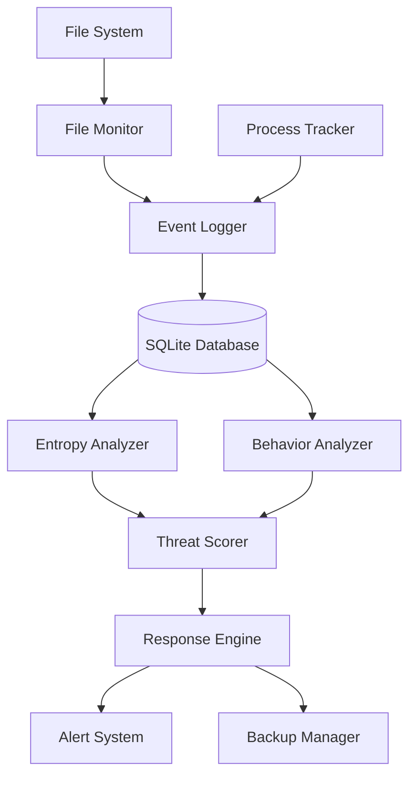

# Ransomware Detection System

A behavioral ransomware detection system that monitors file system activity, detects encryption patterns through entropy analysis, and provides automated backup/rollback capabilities.

## Project Overview

This system is designed to detect ransomware attacks in real-time by analyzing file system behavior and entropy changes. It uses a modular architecture to monitor, analyze, and respond to threats, ensuring data safety through automated backups.

### Key Features
- **Real-time File Monitoring**: Tracks file creation, modification, deletion, and renaming.
- **Entropy Analysis**: Detects encryption by measuring the randomness (Shannon entropy) of file content.
- **Behavioral Analysis**: Identifies suspicious patterns like rapid file modifications or mass renaming.
- **Automated Response**: Isolates threats and triggers automated recovery.
- **Web Dashboard**: Visual interface for monitoring system status and alerts (Phase 6).

## Architecture

The system follows an event-driven architecture with four main layers:

1.  **Monitoring Layer**: Captures file system events (`watchdog`) and tracks processes (`psutil`).
2.  **Analysis Layer**: Calculates entropy and scores behavior to detect threats.
3.  **Response Layer**: Handles automated responses and file recovery.
4.  **Interface Layer**: Provides a web dashboard for user interaction.



## Technology Stack

-   **Language**: Python 3.10+
-   **Core Libraries**: `watchdog`, `psutil`, `numpy`, `Flask`
-   **Database**: SQLite
-   **OS Support**: Windows (primary), Linux (secondary)

## Installation

1.  **Clone the repository**:
    ```bash
    git clone <repository-url>
    cd <repository-directory>
    ```

2.  **Create a virtual environment**:
    ```bash
    python -m venv venv
    source venv/bin/activate  # On Windows: venv\Scripts\activate
    ```

3.  **Install dependencies**:
    ```bash
    pip install -r requirements.txt
    ```

## Usage

### Starting the Monitor
To start the file system monitor:
```bash
python src/monitor/file_monitor.py
```

### Running Tests
To run the test suite:
```bash
python -m unittest discover tests
```

## Project Structure

-   `src/`: Source code for all modules.
    -   `monitor/`: File system monitoring logic.
    -   `analysis/`: Entropy and behavior analysis.
    -   `response/`: Threat response and backup systems.
    -   `dashboard/`: Web interface.
    -   `database/`: Database models and connection handling.
-   `docs/`: Comprehensive project documentation.
-   `tests/`: Unit and integration tests.

## Documentation

Detailed documentation for each phase is available in the `docs/` directory:
-   [Project Overview](docs/PROJECT_OVERVIEW.md)
-   [Architecture](docs/ARCHITECTURE.md)
-   [Phase 1: File Monitor](docs/PHASE1_FILE_MONITOR.md)
-   [Phase 2: Entropy Analysis](docs/PHASE2_ENTROPY_ANALYSIS.md)
-   [Phase 3: Behavioral Detection](docs/PHASE3_BEHAVIORAL_DETECTION.md)
-   [Phase 4: Backup System](docs/PHASE4_BACKUP_SYSTEM.md)
-   [Phase 5: Response System](docs/PHASE5_RESPONSE_SYSTEM.md)
-   [Phase 7: Testing](docs/PHASE7_TESTING.md)
-   [Troubleshooting](docs/TROUBLESHOOTING.md)
